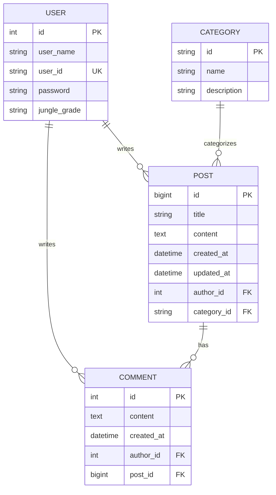

# 🌿 정글 커뮤니티 (Jungle Community)

> **NestJS 기반의 정글 교육생들을 위한 커뮤니티 플랫폼**


## 📋 프로젝트 소개

정글 교육생들을 위한 커뮤니티 게시판입니다. 다른 기수 교육생들과의 교류와 정보 공유를 목적으로 개발되었습니다.

### ✨ 주요 기능

- 🔐 **JWT 기반 인증/인가** - 안전한 로그인 시스템
- 📝 **게시글 CRUD** - 글 작성, 조회, 수정, 삭제
- 🏷️ **카테고리별 분류** - 체계적인 게시글 관리
- 💬 **댓글 시스템** - 활발한 소통 지원
- 📄 **페이지네이션** - 효율적인 데이터 로딩
- 📚 **API 문서화** - Swagger를 통한 자동 문서 생성
- 🚀 **자동 배포** - Railway를 통한 CI/CD

## 🏗️ 기술 스택

### Backend
- **Framework**: NestJS (Node.js)
- **Language**: TypeScript
- **Database**: MySQL
- **ORM**: TypeORM
- **Authentication**: JWT + Passport
- **Validation**: class-validator
- **Documentation**: Swagger/OpenAPI

### DevOps
- **Deployment**: Railway
- **API Testing**: Postman
- **Version Control**: Git/GitHub

## 📊 데이터베이스 ERD



## 🏛️ 프로젝트 아키텍처

```
src/
├── auth/                   # 인증/인가 모듈
│   ├── dto/
│   ├── strategy/
│   ├── auth.controller.ts
│   ├── auth.service.ts
│   └── auth.module.ts
├── user/                   # 사용자 모듈  
│   ├── entities/
│   ├── dto/
│   ├── user.controller.ts
│   ├── user.service.ts
│   └── user.module.ts
├── post/                   # 게시글 모듈
│   ├── entities/
│   ├── dto/
│   ├── post.controller.ts
│   ├── post.service.ts
│   └── post.module.ts
├── category/               # 카테고리 모듈
│   ├── entities/
│   └── category.module.ts
├── comment/                # 댓글 모듈
│   ├── entities/
│   └── comment.module.ts
├── app.module.ts          # 메인 모듈
└── main.ts               # 애플리케이션 엔트리포인트
```

## 🚀 시작하기

### 필수 요구사항
- Node.js (>= 16.0.0)
- MySQL (>= 8.0)
- npm 또는 yarn


## 📡 API 엔드포인트

### 🔐 인증 (Auth)
- `POST /auth/login` - 로그인

### 👤 사용자 (Users)
- `POST /users/signup` - 회원가입

### 📝 게시글 (Posts)
- `GET /post/main?page=1&limit=10` - 전체 게시글 조회 (페이지네이션)
- `GET /post/:category?page=1&limit=10` - 카테고리별 게시글 조회
- `GET /post/:id` - 특정 게시글 조회
- `POST /post/post-create` - 게시글 작성
- `PATCH /post/:id` - 게시글 수정
- `DELETE /post/:id` - 게시글 삭제

## 📚 API 문서

애플리케이션 실행 후 Swagger UI에서 상세한 API 문서를 확인할 수 있습니다.

```
http://localhost:3000/api
```

## 🔐 인증 시스템

### JWT 토큰 구조
```json
{
  "sub": "user_id",
  "user_id": "flaska99", 
  "user_name": "홍길동",
  "jungle_grade": "7기"
}
```

### 보안 기능
- 🔒 bcrypt를 이용한 비밀번호 해싱
- 🛡️ JWT 기반 토큰 인증
- 🚫 CORS 설정으로 크로스 도메인 보안
- ✅ class-validator를 통한 입력값 검증

## 🎯 주요 특징

### 📄 페이지네이션
- 기본 10개씩 게시글 로딩
- 총 페이지 수 계산 자동화
- 최신순 정렬 (ID 기준 내림차순)

### 🏷️ 카테고리 시스템
- 체계적인 게시글 분류
- 카테고리별 필터링 기능

### 🔒 권한 관리  
- 게시글 작성자만 수정/삭제 가능
- JWT Guard를 통한 API 보호

## 🤝 협업 방식

- **백엔드**: NestJS + TypeScript
- **프론트엔드**: React.js 
- **API 테스트**: Postman
- **문서화**: Swagger 자동 생성
- **배포**: Railway (GitHub 연동)
- **실시간 협업**: 배포된 API 서버 공유

## 🔧 개발 스크립트

```bash
# 개발 서버 시작
npm run start:dev

# 빌드
npm run build

# 프로덕션 실행
npm run start:prod

# 테스트
npm run test

# E2E 테스트  
npm run test:e2e
```

## 📈 향후 개선 계획

- [ ] 댓글 CRUD 기능 완성
- [ ] 실시간 알림 시스템
- [ ] 파일 업로드 기능
- [ ] 검색 기능 강화
- [ ] 관리자 페이지
- [ ] 이메일 인증
- [ ] 소셜 로그인

## 👥 팀 구성

- **백엔드 개발**: [@flaska99](https://github.com/flaska99)
- **프론트엔드 개발**: [@JOJoungMin](https://github.com/JOJoungMin)

---

<div align="center">

**🌿 Made with ❤️ for Jungle Community 🌿**
(https://github.com/flaska99/Jungle_Community_Web/issues)

</div>
